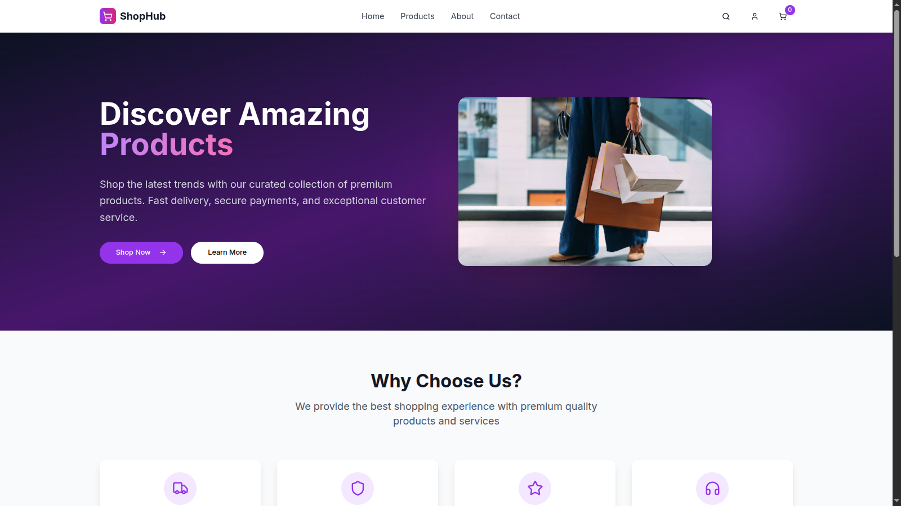
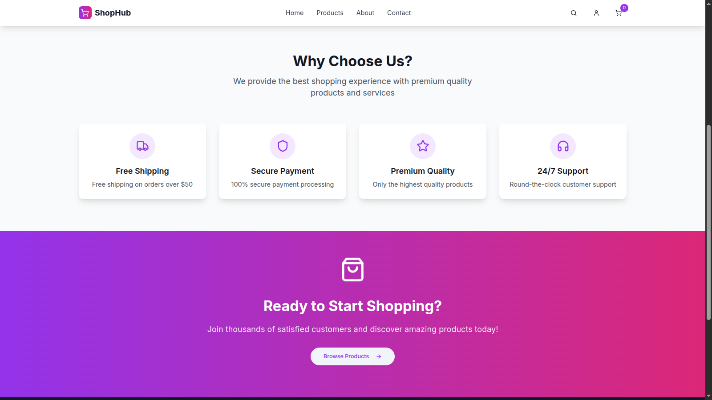
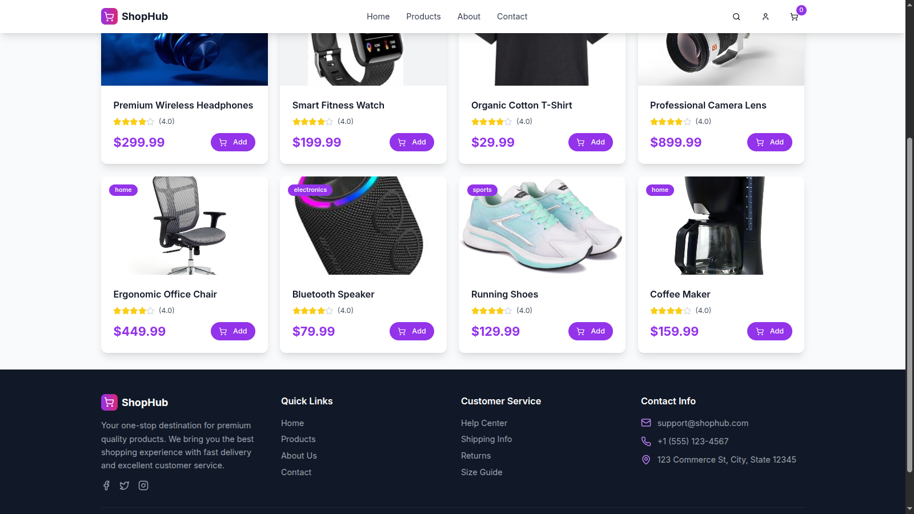
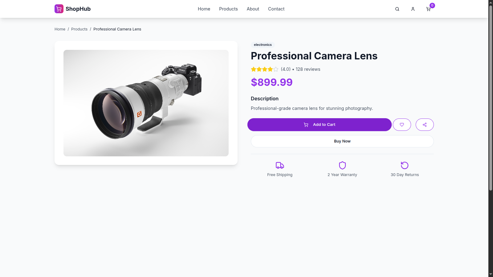

# 🛍️ eCommerce Website

A modern and responsive e-commerce frontend built with **Next.js (App Router)**, **TypeScript**, and **Tailwind CSS**, deployed on **Vercel**. Browse products, use search and filters, and explore dynamic product detail pages — all with seamless UX and polished UI.

---



## 🌐 Live Demo

[eCommerce Website](https://ecommerce-website-mauve-one.vercel.app/)

---

## ⭐ Features

- 🛒 Product listing with **search** and **category filter**
- 📦 Individual **product detail pages**
- 🖼️ Responsive **image handling** using `next/image`
- 🚀 Fast, SEO-friendly **server-side rendering**
- 🛠️ Robust **API routes** under `app/api/products`
- 🎨 Clean UI using **Tailwind CSS** and **Lucide icons**
- 🔁 Dynamic fetch logic supporting **both localhost and Vercel**

---

## 🧭 Tech Stack

- **Framework**: [Next.js](https://nextjs.org/) (App Router)
- **Language**: TypeScript
- **Styling**: Tailwind CSS
- **Icons**: [Lucide React](https://lucide.dev/)
- **Deployment**: [Vercel](https://vercel.com/)

---

## 🚀 Getting Started

### 1. Clone the Repo

```bash
git clone https://github.com/ras41/ecommerce-website.git
cd ecommerce-website
```

## 2. Install dependencies

```bash
npm install
### or
yarn install
```

## 3. Run the development server

```bash
npm run dev
### or
yarn dev
```

Then open http://localhost:3000/products in your browser.

## 📦 API Endpoints

### /api/products

- GET - Get all products

- Supports query parameters:

  - ?search=term

  - ?category=electronics

## /api/products/[id]

- GET - Get a single product by ID

- DELETE - Delete a product by ID

## 📁 Project Structure

```bash
app/
├── api/
│   └── products/
│       ├── route.ts         // List + Create products
│       └── [id]/route.ts    // Fetch/Delete product by ID
├── products/
│   ├── page.tsx             // Product listing page
│   └── [id]/page.tsx        // Single product page
components/
├── ProductGrid.tsx
├── ProductCard.tsx
types/
└── product.ts               // TypeScript product type
public/
└── images/                  // Product image assets

```

## 🚀 Deployment

- This project is ready for Vercel deployment out of the box.

- Just push to GitHub and import into Vercel — no config needed.

## 🧪 Troubleshooting

### Product pages not loading?

- Check API URLs are dynamic (headers().get('host')) and avoid hardcoded localhost.

### Broken images?

- Ensure all product image files exist in the /public/ folder.

## 📸 Screenshots

<!-- 



 -->

<div align="center">

<table>
  <tr>
    <td align="center">
      
      <br/><sub><b>Homepage</b></sub>
    </td>
    <td align="center">
      
      <br/><sub><b>Homepage</b></sub>
    </td>
  </tr>
  <tr>
    <td align="center">
      
      <br/><sub><b>Products</b></sub>
    </td>
    <td align="center">
      
      <br/><sub><b>Filtered View</b></sub>
    </td>
  </tr>
  <tr>
    <td align="center" colspan="2">
      
      <br/><sub><b>Product Details</b></sub>
    </td>
  </tr>
</table>

</div>

## 📄 License

This project is licensed under the MIT License.

## 🙌 Acknowledgements

Built as part of an eCommerce internship project

Inspired by modern e-commerce UIs and real-world design systems
